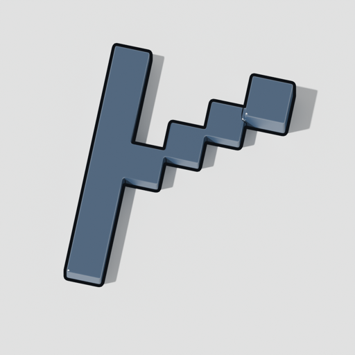

<!-- brand:logo -->

# forge

<!-- catalog:header — generated by `pub catalog render`; do not edit by hand -->
**Ring:** system · **Layers:** L8 · **Wave:** 2 · **Tier:** incubating

Code forge (repos, issues, reviews, packages, federation) on gitoxide; the future canonical home of this org.

Planned components: pubd-forge · ForgeFed · mirror bot
<!-- catalog:end -->

## In 30 seconds

_A runnable example goes here the day the first crate lands._

## What it does

## What it does not do (yet)

## Status

| Ledger entry | Readiness | Next |
|---|---|---|

## How it fits the suite

Implements: _none yet_ · Requires: _none yet_ (see `CATALOG.toml`)

## Contributing

`pub check` must pass. See the org-wide [CONTRIBUTING](https://github.com/public-software/.github/blob/main/CONTRIBUTING.md) and `PROVENANCE.md`.

## Provenance

See `PROVENANCE.md`.
